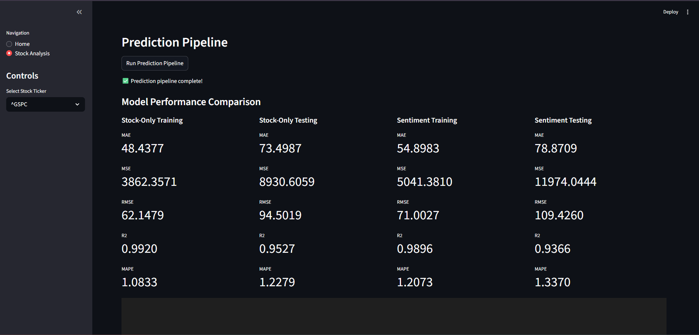

# FinPulse


## Overview

FinPulse is an advanced financial analysis platform that combines historical stock market data with cutting-edge sentiment analysis from news articles. Leveraging state-of-the-art NLP models and deep learning, FinPulse provides investors and analysts with actionable insights and accurate price predictions.

---

## Table of Contents

- [Overview](#overview)
- [Key Features](#key-features)
- [Project Architecture](#project-architecture)
- [Demo](#demo)
- [Installation](#installation)
- [Usage](#usage)
- [Results](#results)
- [Screenshots](#screenshots)
- [Contributing](#contributing)
- [License](#license)

---

## Key Features

- 📈 Real-time stock price visualization
- 📰 Automated news sentiment extraction using FinBERT (ProsusAI/finbert)
- 🤖 LSTM-based price prediction with and without sentiment scores
- 🔍 Model performance benchmarking (MAE, RMSE, R², MAPE)
- 📊 Comparison of sentiment-enhanced vs. stock-only predictions
- ⚡ Interactive dashboard UI (Streamlit)

---

## Project Architecture

- Data collection from Yahoo Finance, news APIs [GDLET]
- Sentiment score calculation through pre-trained FinBERT
- Data preprocessing and feature engineering
- LSTM neural network modeling
- Visualization and comparison of predictive results

---

## Demo

 <!-- Add dashboard or representative demo image/gif here -->

---

## Installation

1. Clone this repository:
    ```
    git clone https://github.com/yourusername/finpulse.git
    cd finpulse
    ```

2. Install dependencies:
    ```
    pip install -r requirements.txt
    ```

3. Download or configure FinBERT:
    ```
    # Instructions for setting up FinBERT locally
    ```

4. Launch the Streamlit dashboard:
    ```
    streamlit run main.py
    ```

---

## Usage

- Choose a stock ticker from the sidebar (e.g., TSLA, S&P 500)
- View latest news and sentiment scores
- Run the predictive pipeline to generate LSTM results
- Compare error metrics for stock-only and sentiment-enhanced models
- Analyze trends with interactive charts

---

## Results

Below are major sample results from FinPulse’s predictive pipeline. Each image demonstrates key analysis or model comparisons for stock price prediction and sentiment integration.

### Prediction Results & Performance Visualizations

 <!-- Replace with your image filename -->
 <!-- Replace with your image filename -->
 <!-- Replace with your image filename -->
 <!-- Replace with your image filename -->

<!-- Add captions or brief explanations under each image if desired -->

---

## Screenshots


<!-- Add more screenshots related to different features of your app -->

---

## Contributing

Contributions are welcome! Please open issues to suggest improvements or submit pull requests.

---

## License

Distributed under the MIT License. See `LICENSE` for more information.

---

## Acknowledgments

- FinBERT by ProsusAI
- Yahoo Finance API
- Streamlit community
- [Base paper authors—cite properly here]

---

<!-- Replace image links with your actual image files and update metric tables with your real results. -->
